###

```mermaid
---
---
config:
  kanban:
    ticketBaseUrl: 'https://github.com/jyasuu/#TICKET#'
---

kanban
  🧠 Languages
    [#️⃣ C# ]
    [☕ Java]
    [🌐 TypeScript / JavaScript]
    [🐍 Python]
    [🐹 Golang]
    [🦀 Rust]

  🧱 Frameworks
    [🧩 .NET]
    [🚀 Spring Boot]
    [⚛️ React]
    [🖼️ Vue.js]
    [📦 Next.js]

  🛢️ Databases & Storage
    [🐘 PostgreSQL]
    [🏛️ Oracle]
    [🧠 MSSQL]
    [🔥 MongoDB]
    [💾 Redis]
    [🔍 Elasticsearch]
    [📦 MinIO]
    [🔐 Vault]

  ⚙️ DevOps & Tooling
    [🐳 Docker]
    [🛠️ GitLab CI/CD]
    [📦 Ansible]
    [☸️ Kubernetes]
    [📈 Prometheus]
    [📉 Grafana]
    [🧾 Graylog]
    [🌍 Terraform]

  🚀 Other Skills
    [🌐 Nginx]
    [📬 RabbitMQ]
    [📦 Tailwindcss]

```

---

###

<h3 align="left">🔥   My Stats :</h3>

###

  

###

  
  

###

  

###

<picture>
  <source media="(prefers-color-scheme: dark)" srcset="https://raw.githubusercontent.com/jyasuu/jyasuu/pacman/pacman-contribution-graph-dark.svg">
  <source media="(prefers-color-scheme: light)" srcset="https://raw.githubusercontent.com/jyasuu/jyasuu/pacman/pacman-contribution-graph.svg">
  
</picture>

###

###

  
  
  
  
  
  
  
  
  
  
  
  
  
  
  
  
  
  
  
  
  
  
  
  
  
  
  
  
  
  
  
  
  
  
  
  
  
  
  
  
  
  
  
  
  
  
  
  
  
  
  
  
  
  
  
  
  
  
  
  
  
  
  
  
  
  
  
  
  
  
  
  
  
  
  
  
  
  
  
  
  
  
  
  
  
  
  
  
  
  
  
  
  
  
  
  
  
  
  
  
  
  
  
  
  
  
  
  
  
  
  
  
  
  
  
  
  

###

  

